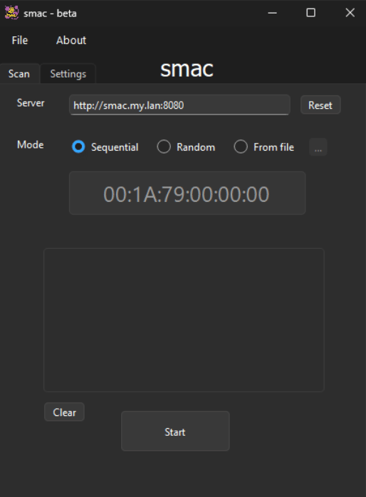
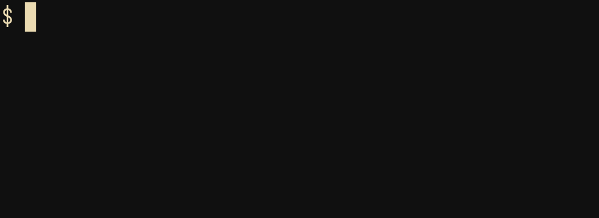

Cross-platform MAC scanner with GUI and CLI.

<p align="center">
     <table>
      <tr valign="top">
        <td>GUI</td>
        <td>CLI</td>
      </tr>
      <tr valign="top">
        <td width="50%"></td>
        <td width="50%"></td>
      </tr>
    </table>
</p>
    
Works on Windows and Linux.

> [!WARNING]
> `smac` is experimental

# Quick start

Download latest release for your platform.

- Windows:
- Linux: 

Launch `smac` for the command-line version, or `smac-gui` for the graphical one.

# Overview

```console
$ smac --help
USAGE: smac [--url] <server> [OPTS]
OPTS:
    TARGET:
        -u <server> : server URL

    SCAN MODE:
        --seq : scan sequentially from [--first] to [--last] MAC
        --random : scan randomly between [--first] and [--last] MAC
        --mac-file <FILE> : scan only MACs contained in FILE

    REQUESTS:
        --delay <MILLIS> : delay after each checking request
        --pause <INT> : pause every INT checking request
        --pause-for <MILLIS> : pause duration
        --timeout <MILLIS> : set timeout (default = 3000 ms)
        --stop <INT> : stop after INT check (default = 0)
        --threads <INT> : parallel requests (default = 1)
```
    
Those options are self-explorable via the graphical interface.

# Build from source

`smac` is not statically compiled (yet?).
It depends on:

- `curl`
- `Qt6`

## Linux

```console
$ git clone https://github.com/dougy147/smac
$ cd ./smac
$ wget https://curl.se/download/curl-8.21.0.tar.gz
$ mkdir ./3rd
$ tar -C 3rd -xvf curl-8.21.0.tar.gz
$ make linux
```

This produces the CLI and GUI executables:
    
- `./release/linux/smac`
- `./release/linux/smac-gui`

## Windows

```console
$ git clone https://github.com/dougy147/smac
$ cd ./smac
$ wget https://curl.se/windows/dl-8.21.0_6/curl-8.21.0_6-win64-mingw.zip
$ unzip -d 3rd curl-8.21.0_6-win64-mingw.zip
$ make windows
```

This produces the CLI and GUI executables:
    
- `./release/windows/src/smac.exe`
- `./release/windows/src/smac-gui.exe`

Some mandatory DLLs (but this is not exhaustive..) can be found with:

```console
$ objdump.exe -p ./release/windows/src/smac-gui.exe | grep "DLL Name"
```

Include them next to main `smac-gui.exe` file.